# 服务器歌单教程

<script async src="//busuanzi.ibruce.info/busuanzi/2.3/busuanzi.pure.mini.js">
</script>

**要使用此功能，您必须在综音APP内登录！**

目前账号可通过在吐个槽中发送您通过用户名生成的注册码，由管理员手动为你注册。

本教程使用的版本为：```3.3.2```

## 配置APP内服务器设置

首先前往设置页，找到服务器配置设置项：

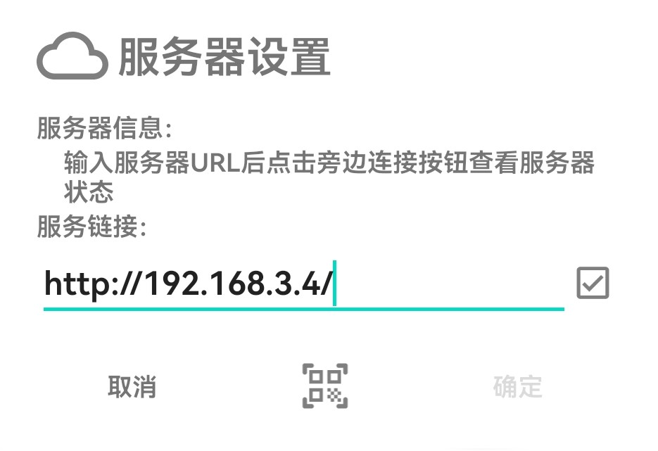

点开后在服务链接处填入提供的服务端URL，然后点击右边的小对勾检查用户在服务器中的注册情况（如下图），如未注册，则会显示邀请码填写框，服务端会根据输入的邀请码为你注册用户并确定用户等级（一般管理员权限需要6位数邀请码，普通用户需要4位邀请码）

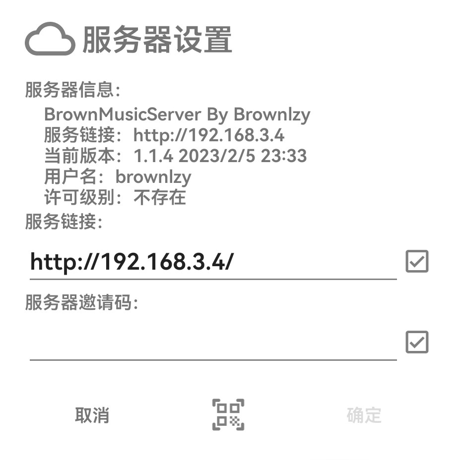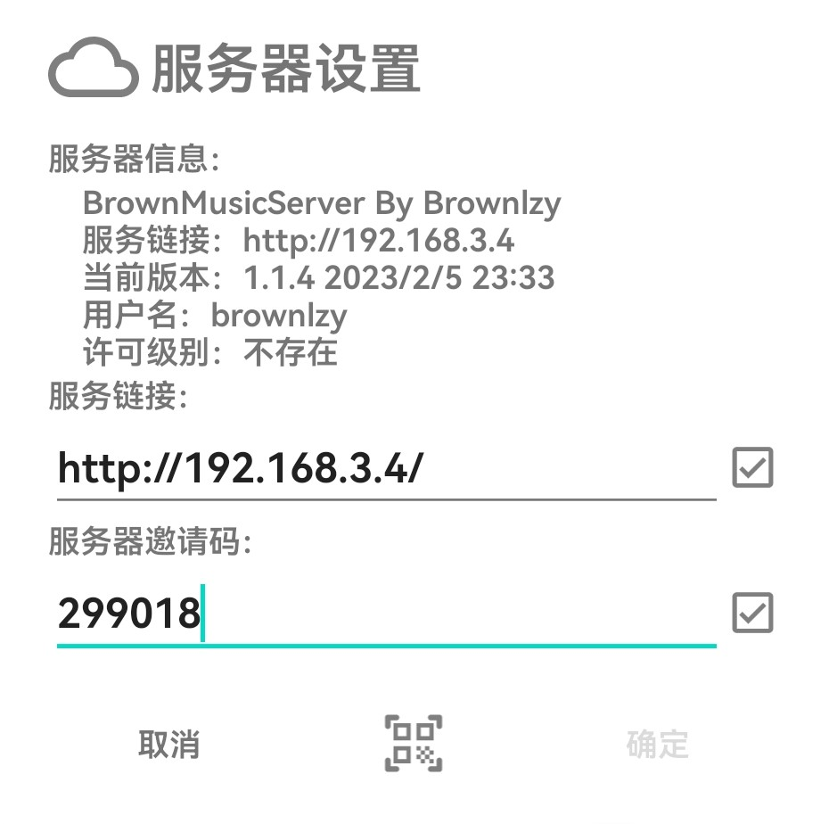

此处以管理员邀请码为例，填写邀请码后点击右侧对勾进行注册，若注册成功，则可以看到许可级别一栏显示对应的权限等级，然后点击登录，服务器一栏出现配置信息后即登录成功：

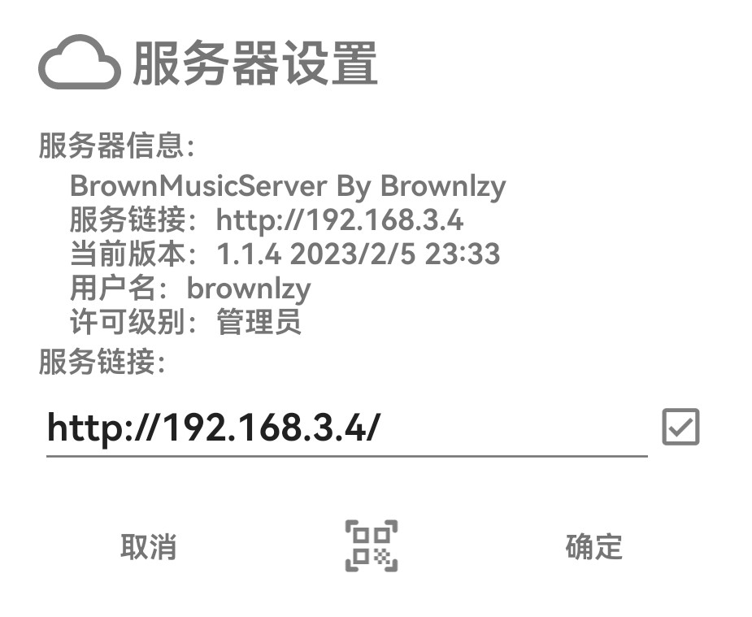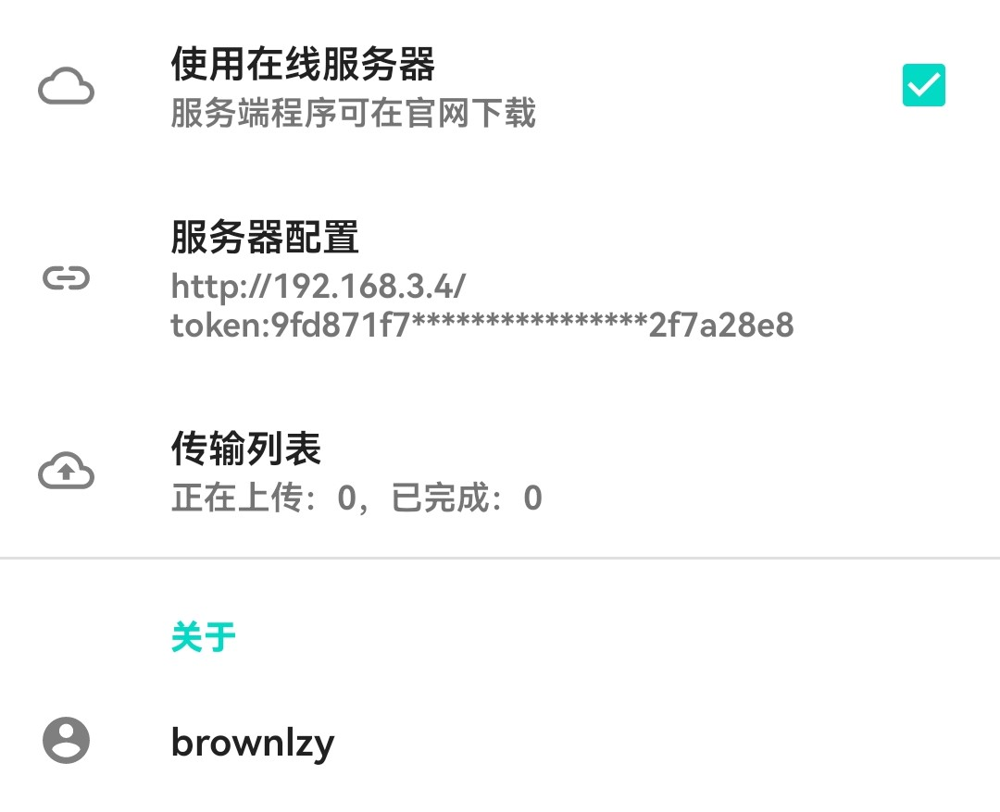

勾选“使用在线服务器”，App将为您加载服务器中的歌单，回到曲库列表可以看到新增的列表。其中所有歌曲（admin）默认出现在所有管理员的歌单列表中，括号内为该歌单的创建用户，管理员具有管理其他歌单的权限，普通用户只能修改由其自行创建的歌单。

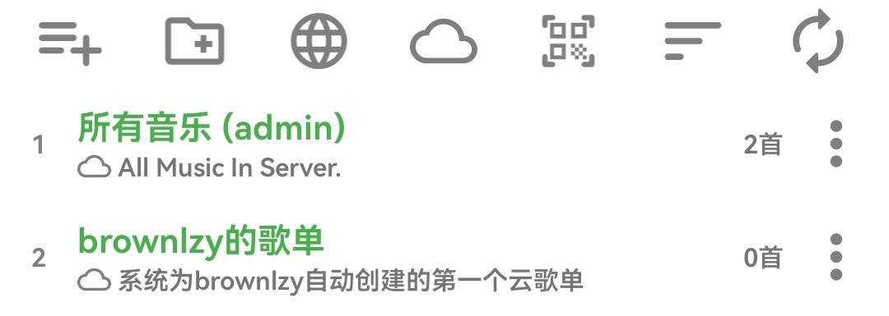

## 向歌单中上传歌曲

目前用户可以从其他歌单中上传本地歌曲至云歌单，方法如下：

首先准备一个内有本地音乐的普通歌单或文件夹歌单，在歌单内点击一首本地歌曲的更多按钮，选择添加到歌单，再选中想加入的歌单，然后确定。

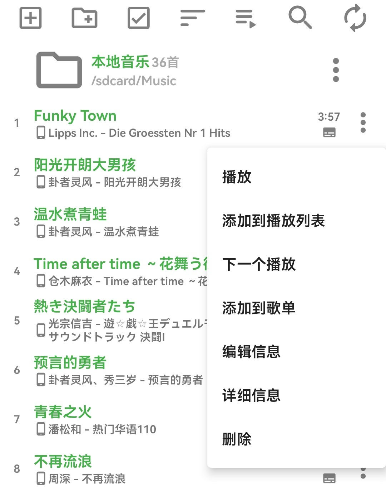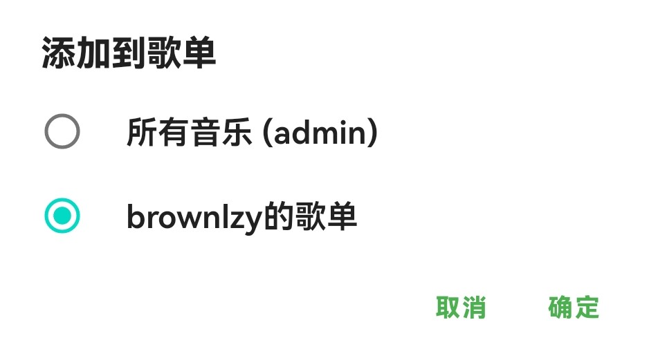

弹出成功提示后，可前往设置页-传输列表查看上传任务状态。

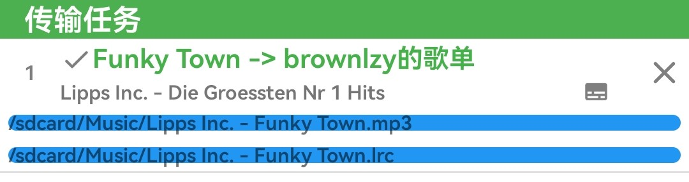

此时回到歌单刷新，可以看到新上传的歌曲：

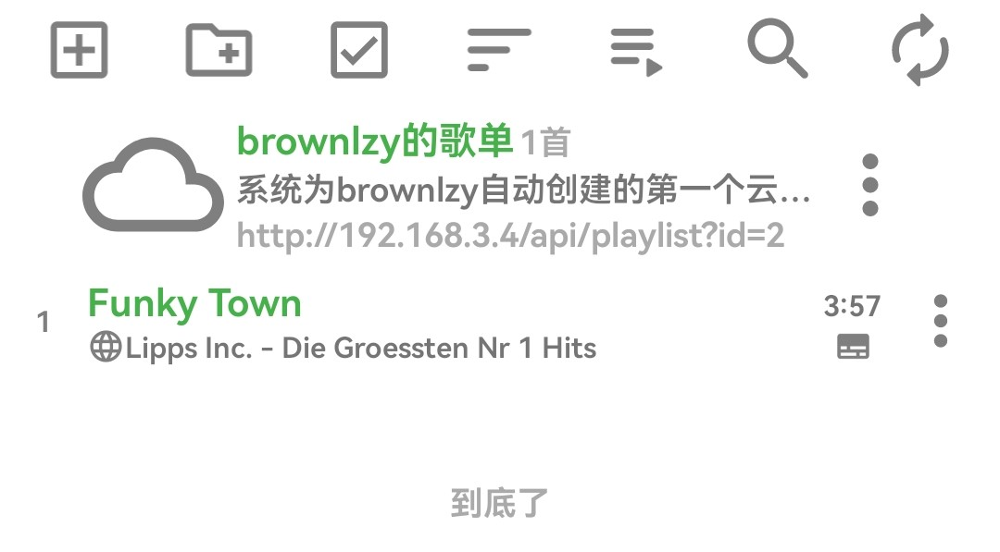

## 歌单分享功能

您可以通过歌单分享功能将此歌单分享给位于同一服务器的用户，该用户可以收到您歌单的实时更新。在歌单列表选中“更多”-“分享”，将二维码展示给要分享的朋友，对方通过曲库歌单列表顶栏的二维码扫描功能即可成功添加到曲库。

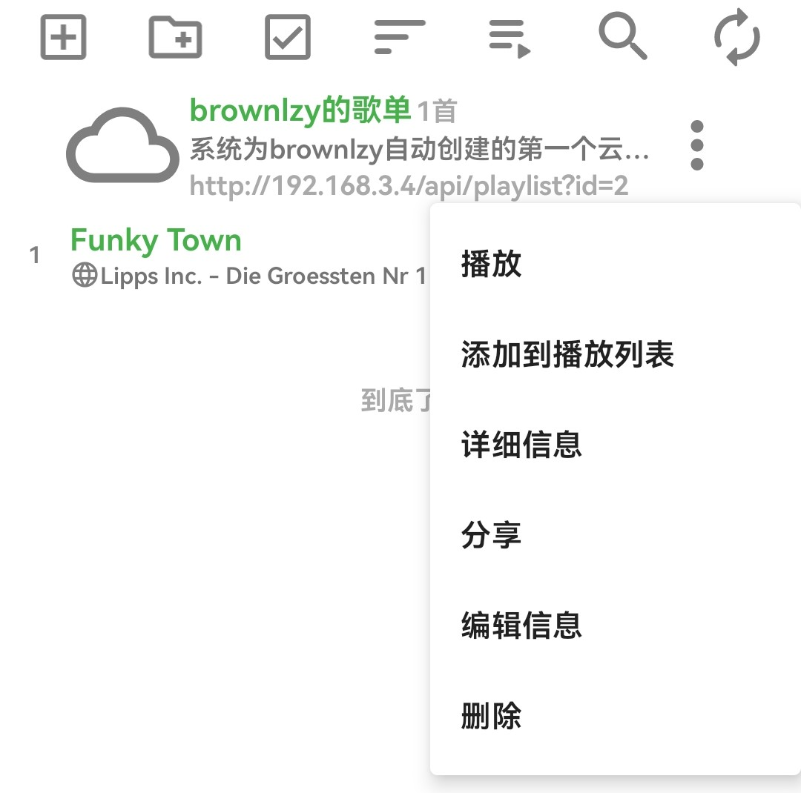

本文总阅读量<span id="busuanzi_value_page_pv"></span>次