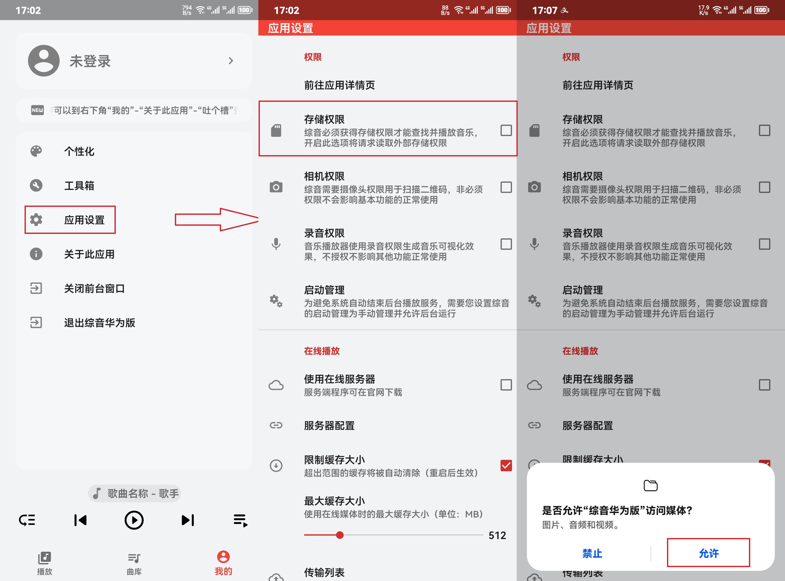
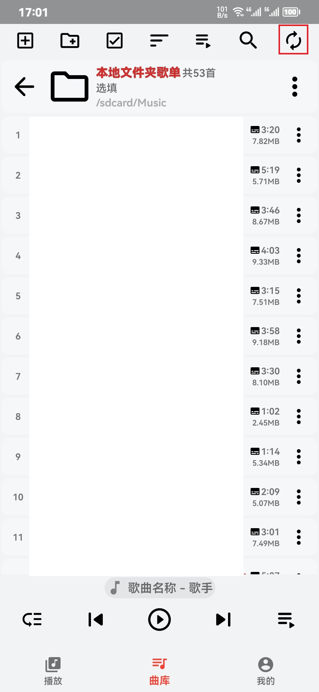

# 创建基于文件夹的本地歌单

首先保证已经授予APP存储权限（可以在“我的”-“应用设置”-“权限”查看授权情况）

1、前往曲库页面，点击左上角\[三横加号\]添加歌单，在弹出窗口中选择歌单类型为文件夹，并填写歌单名称和简介后点击确定。

2、在新弹出的页面里选择装有音乐和歌词文件的文件夹（例如某听歌软件的默认下载路径是“/内部存储/PMSLLM/Music/”），进入后点击下方“使用此文件夹”按钮并确定。

3、如果选择的文件夹可以被访问，综音将自动扫描选定目录下的音频文件，并读取标签信息形成歌单。此后只需要点击歌单内右上角刷新图标即可重新扫描新增的文件。

本文总阅读量次