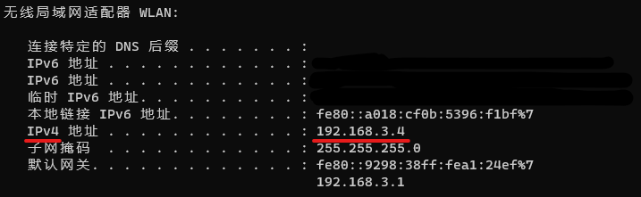
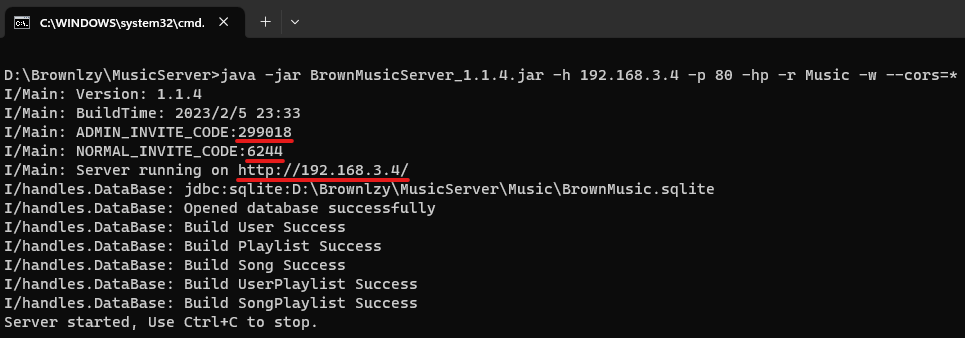
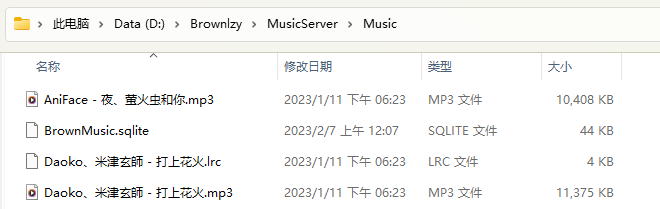

# 服务器配置教程

<script async src="//busuanzi.ibruce.info/busuanzi/2.3/busuanzi.pure.mini.js">
</script>

首先需要准备好最新版**综音服务端程序**，程序可在[官网](https://ota.abrown.top/MusicPlayer/)下载。

本教程使用的版本为：```1.1.4```

## 服务端的搭建

### 准备服务端程序工作环境

服务端程序由Java编写，支持Windows、Linux、Mac系统，推荐Java版本为Java11以上。关于Java环境的配置可参考知乎文章[Java基础篇——环境配置](https://zhuanlan.zhihu.com/p/107859108)，本教程以Windows11+Java17为例。

### 配置服务端

下载服务端文件BrownMusicServer\_1.1.4.jar，将它放在一个不含中文的路径下（如：D:\\Brownlzy\\MusicServer），如图所示：


在该文件夹下，新建一个txt文本文件命名为start.txt和一个文件夹并命名为Music：


打开新建好的start.txt并输入以下命令：

```cmd
java -jar 程序文件名 -h IP地址 -p 端口号 -r 音乐文件夹 -w --cors=*
```

**注意：** 程序文件名需要视情况修改；本机IP可通过系统设置-网络-属性中的IPv4一栏找到，或者输入Win+R，在弹出窗口中输入cmd后回车，并在打开的黑色窗口中输入ipconfig后再回车，在出现的信息中找到IPv4：



获得；端口号部分可整体替换为```80 -hp```或```1024```-```65536```中的任意可用**整数**，如果启动失败可用多试几个；音乐存放位置在本教程中可以填写完整位置D:\\Brownlzy\\MusicServer\\Music或相对位置Music，注意，若路径中含空格则需要用英文双引号将路径括起来。更多参数可以使用 ```java -jar BrownMusicServer_1.1.4.jar --help``` 查看。

按照上面的规则，确定了最终内容为

```cmd
java -jar BrownMusicServer_1.1.4.jar -h 192.168.3.4 -p 80 -hp -r Music -w --cors=*
```

保存好后重命名为```start.bat```。

### 启动服务器程序

双击文件```start.bat```：



看到如图所示内容则说明运行成功，其中展示了几个重要信息：

本次运行的**管理员注册码**为```299018```，**普通用户注册码**为```6244```，服务器**Web网页链接**为 ```http://192.168.3.4/```

## 服务端的使用

首先在浏览器中打开所给链接：


账号密码见App服务端配置登录成功后的二维码下方。

登录成功后可见


看到此窗口则说明web端可以正常使用，你可以在此页面上传常见歌曲文件和lrc歌词文件，或者手动向前文Music文件夹中添加文件：



然后并点击网页中的扫描音乐目录按钮即可使用web端听歌。


本文总阅读量<span id="busuanzi_value_page_pv"></span>次